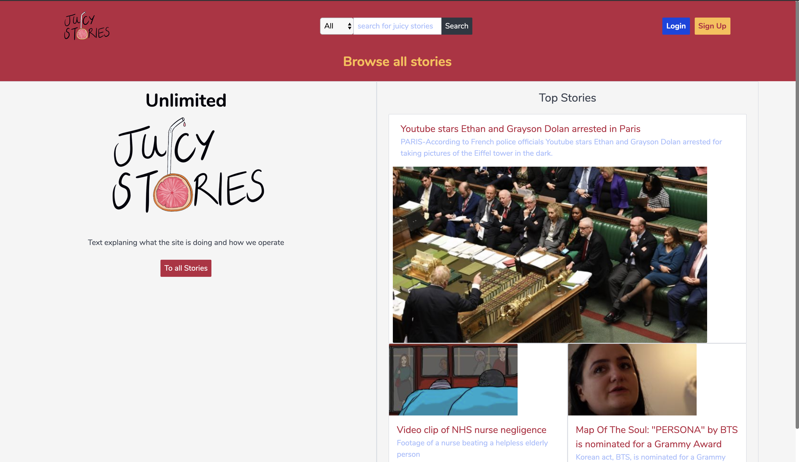
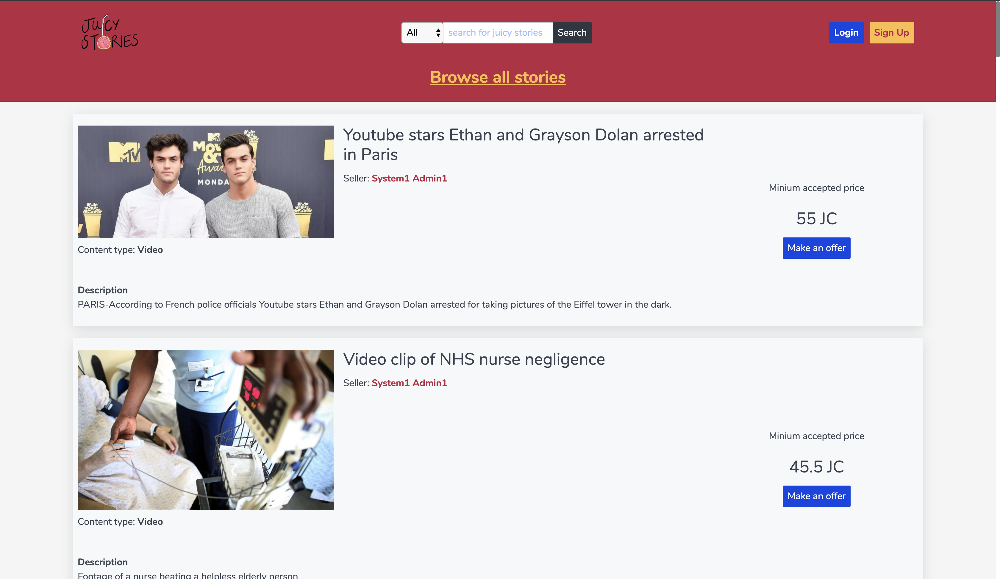
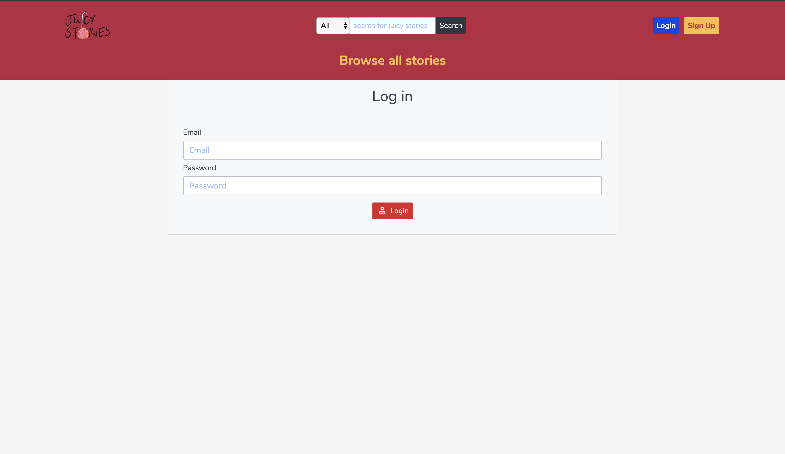
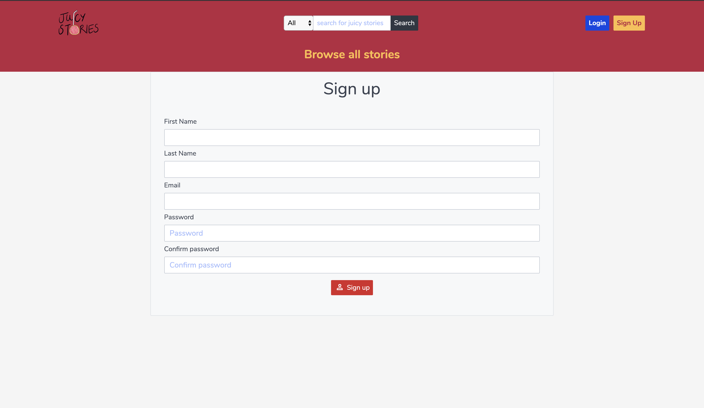
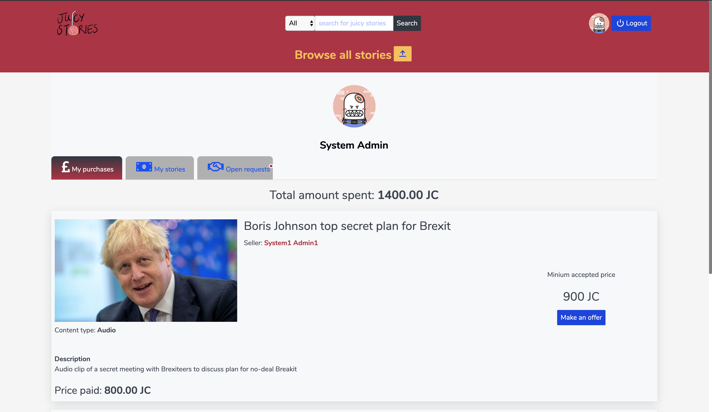
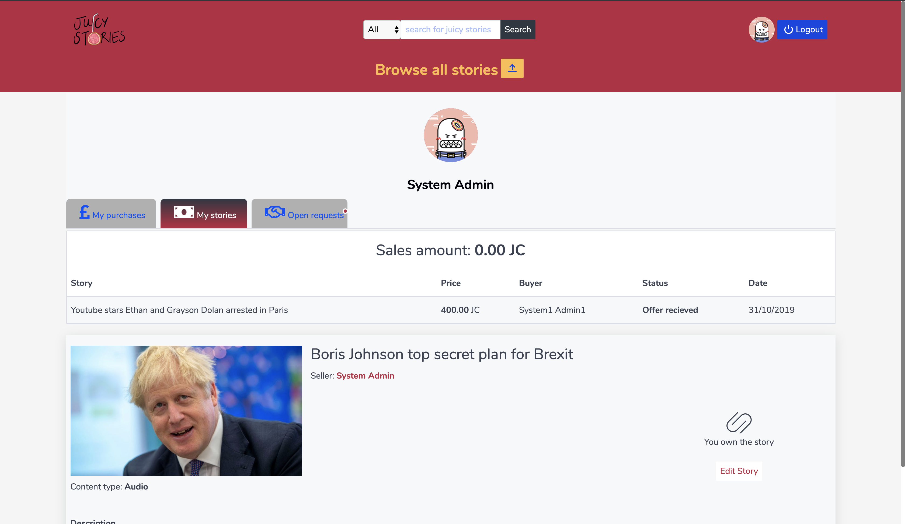
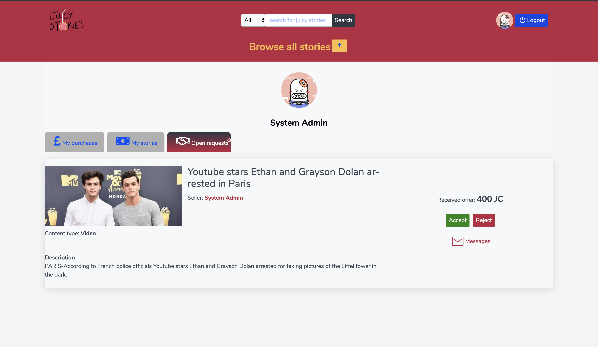

# SEI - Juicy Stories- Project 3
Our third project consisted of building a marketplace for content in one week.

---

# Marketplace for publishers to purchase content.

We were tasked with creating a full MERN stack web application , from an idea we came up with ourselves. - Coming up with an idea sounds much easier then it is! You have to consider product viability , time alloted to you and your team. The complexeties of the end product. 

## Built With

1. React
2. Mongoose
3. NodeJS
4. Express

## Marketeplace Mechanics

A online marketplace where users can sign-up to either list content to sell or find exclusive content to purchase. You arrive at a homepage which lists the top three stories / three pieces of exclusive content. The page consists of a navbar that has a logo. A search bar where you can search for specific video,images and audio. The login button which redirects to a login page. The sign-up button which redirects to a sign-up page and finally a button which links to a page listing all the stories/content available.Then theirs two sections. One which gives a minor explanation of the website with a button which redirects to all stories. The second one which lists the top three most visted stories (not built in yet).  

Once a user is signed-in , they have access to a dashboard in which they can view their purchases. Their sales and a area in which they can negotiate pricing on the stories they're buying and selling. 

## Added Extra Features

## Future improvements

## Author

Kirmaan Aboobaker - http://github.com/Kirmaan

